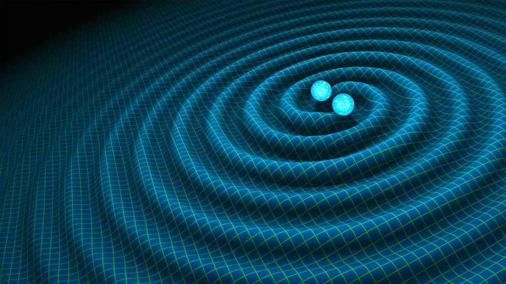

# Subthreshold-Bright-Sirens
The venture to seek bright siren events that have slipped under the radar of gravitational wave inferometers. So called "shadow sirens" are attempted to be uncovered via the use of GRB catalogues to pinpoint them on the sky, and improved noise modelling to increase our confidence that an event occurred.

# Getting Started...
## We use Python 3.11.9 . If using Tursa you can find out how to use 'spack' and add it to your .bashrc startup file. Then you can bash 'spack load python@3.11.9'
1. Create a python virtual environment (via spack/conda/pyenv etc.)
2. !important! pip install a cuda activated jax version i.e. 'pip install "jax[cuda12]"==0.10.2 '
3. pip install blackjax from the handley-lab repo: most importantly you need a version with the "stepper_fn". Here is the exact branch we used, in our environments: 

    git clone https://github.com/handley-lab/blackjax/tree/2180e29ffb645b2c46b76c768229c7c24212446c
    cd into the cloned repository
    python -m pip install .

    You may find a more recent branch from this repo will still have this functionality, and new features, too.
4. pip install -r "requirements.txt" 
    Note: you may have to cd back into this repo, where requirements.txt is installed

# SFM_baseline_GW170817_GRB_extended
Summer project work by Sienna Folkes-Miller:

The following folder provides the workflow to target potential subthreshold sirens guided by GRB detections. The pipeline selects suitable GRBs from the Fermi GBM Burst Catalogue (https://heasarc.gsfc.nasa.gov/W3Browse/fermi/fermigbrst.html) and downloads available strain data from LIGO Hanford, LIGO Livingston and Virgo around the GRB GPS time. A simple Welch estimate is used to estimate the PSD. An unconditioned prior (full sky) and conditioned prior (gaussian on GRB location) are applied and nested sampling is run for each prior using the IMRPhenomD_NRTidalv2 binary neutron star waveform. The primary quantity of interest is the ratio of evidences between the two runs, with a significant $\Delta \log Z$ implying a preference towards the higher evidence model. The pipeline has been validated on GRB170817529 which is associated with the confirmed bright siren GW170817. Preliminary runs have been performed on a further 83 suitable GRBs. Most runs have no model preference implying the strain data contains only noise, although there are a few promising results!
## FOLDERS:
- data
    - grb_catalogue.csv saves here: contains list of GRBs with GPS, RA, DEC, T90 and LIGO run info
    - grb_results.csv saves here: contains list of GRB results including valid detectors, unconditioned, conditioned and  $\Delta \log Z$ with errors and MAPs across all parameters for both unconditioned and conditioned runs
    - individual GRB output directories save here: generated for each GRB when data download occurs in SFM_data_collection_GRB.py file, may contain H1, L1 and V1 strain files (.hdf5), metadata file (.pkl), unconditioned and conditioned transient samples (.csv), unconditioned and conditioned corner plots (.png), strain data plot (.png), MAP comparison plot (.png) and time-frequency histogram (.png)
- pipeline
    - deprecated folder: contains older files which may be relevant if moving onto heterodyned likelihood in the future
    - _plot_utils.py: contains useful functions for plotting corner plots or finding the MAP of a posterior
    - SFM_data_collection_GRB.py:
        - If catalogue_read = True at start of file, it queries the Fermi GBM Burst Catalogue and saves the list of suitable GRBs to grb_catalogue.csv. The conditions for 'suitable' can be changed, and currently requires trigger times to be within LIGO observing windows, T90<3s and error radius <10 degrees.
        - GRBs in the list SELECTED_GRBs = ["GRB012345678"] will have their strain data downloaded from LIGO Hanford, LIGO Livingston and Virgo detectors. Leaving the list empty will loop over all GRBs in the grb_catalogue.csv, and specified GRBs must exist in the downloaded catalogue. Data is saved to the GRB specific output folder, and is only saved if the full segment selected exists and there are no Nans, hence not all GRBs will have three strain files.
    - SFM_sampling_GRB.py: 
        - Must be run with parser argument --grb-names GRB012345678 and is intended for GPU use.
        - Performs unconditioned (full sky prior) and conditioned (GRB location gaussian prior) nested sampling on a single GRB location and saves both sets of samples to the GRB specific output folder. Gaussian stds are chosen to be 0.2rad in RA and 0.1rad in Dec, but can be altered.
        - Sampling uses TransientLikelihoodFD (full parameter space), phase marginalization, IMRPhenomD_NRTidalv2 waveform and a Welch estimate for the psd.
        - Priors are set reasonably wide to encompass most physical parameters whilst keeping run time suitable. Most importantly, coalescent time has a prior between [-10,0] as the time delay between GW and GRB events is not well constrained.
        - Default settings use 500 live points, 0.3 x live point ndelete and 8 x dimensions for nmcmc.
        - Script was built from a previous file using heterodyning, so there may be left over artefacts that are no longer used. References to H0 and vp fitting are purposely left commented out but not deleted as they may be relevant in the future.
    - SFM_analysis_GRB.py:
        - Uses same format as SFM_data_collection_GRB.py with SELECTED_GRBs = ["GRB012345678"] and looping over all directories if list is empty.
        - If strain_plotting = True, plots and saves graph of strain data and a time-frequency histogram for all valid detectors.
        - If logZ_and_maps = True, calculates unconditioned, conditioned and  $\Delta \log Zs$ as well as MAPs across all parameters. Saves results along with other important metadata to grb_results.csv.
        - If corner_plotting = True, plots and saves unconditioned and conditioned corner plots.
        - All images are saved to grb specific output folder.
    - SFM_results_GRB.py:
        - Uses same format as SFM_data_collection_GRB.py with SELECTED_GRBs = ["GRB012345678"] and looping over all GRBs in results file if list is empty.
        - Prints table of unconditioned, conditioned and delta logZ with errors for all GRBs, ordering from highest to lowest delta logZ.
        - For specified GRBs, plots MAPs and medians with 16-84 percentile error bars for each parameter for both unconditioned and conditioned samples. Saves to grb specific output folder.
- SFM_archive
    - 7 folders containing unconditioned and conditioned samples, corner plots, strain data etc for the GRBs that were identified by SFM as having significant results (sufficient positive or negative $\Delta \log Zs$)
    - grb_catalogue.csv for work done by SFM
    - grb_results.csv for work done by SFM
## COMMENTARY
- workflow:
    - Run SFM_data_collection_GRB.py with catalogue_read = True to build grb_catalogue.csv
    - Run SFM_data_collection_GRB.py with SELECTED_GRBs = [] to download data over all GRBs in grb_catalogue.csv (~minutes per GRB so may be worth doing in smaller sections)
    - Run SFM_sampling_GRB.py --grb-names GRB012345678 for each GRB you are interested in, each NS run takes ~30mins for pure noise data but can increase up to 2.5hrs for more interesting signals and remember each run requires two NS runs
    - **NOTE** TransientLikelihoodFD may require a100-80s instead of standard a100-40 depending on the settings...
    - Run SFM_analysis_GRB.py with SELECTED_GRBs = [] and logZ_and_maps = True to build grb_results.csv. Optionally use strain_plotting = True and corner_plotting = True to generate extra plots.
    - Run SFM_results_GRB.py to print table of evidences in order of decreasing  $\Delta \log Z$ to investigate results. Set SELECTED_GRBs = [] to include your interesting GRBs to plot the changes in the MAPs and medians across unconditioned and conditioned runs for all parameters.
- current results:
    - Fully validated on GRB170817529 which is associated with confirmed bright siren event GW170817529, producing a $\Delta \log Z \= 5.233 \pm 0.453$ and recovered parameters such as chirp mass, luminosity distance and sky coordinates in agreement with literature values.
    - Total 84 GRB candidates (including GW17 event) that occured within LIGO observing runs, T90<3s and error radius<10 degrees. 77 GRBs resulted in $\Delta \log Z$ between -1 and 1, with $\log Zs$ close to zero in both unconditioned and conditioned cases, implying no significant GW signals. 
    - GRB240715239 and GRB190728271 (previously flagged in Will Templeton's Masters' Project) both had $\Delta \log Z$ between 1 and 2 and higher than average $\log Zs$.
    - GRB240824549, GRB170403583, GRB190810675 and GRB240603102 all have higher than average $\log Zs$ and $\Delta \log Zs$ <-1, potentially implying the presence of a signal that is not attributed to the target GRB. From a quick search in the LVK public alerts, there are no detected GW events at these gps times that could be attributed for the apparent signal. All four events have either 2 or 3 valid detectors and there's no obvious visual issues with their strain data.
- future work to be done:
    - Improved noise modelling may increase the $\Delta \log Zs$ for the promising events.
    - The current time-frequency histograms do minimal noise 'cleaning' so are hard to interpret. This could also be improved with further noise modelling.
    - Longer runs should be performed on the interesting GRBs. Observing the variation in evidence between runs should also be studied.
    - The highlighted GRBs of interest require further investigation, including studying their corner plots and MAPs/medians across unconditioned and conditioned runs. GRB240603102 in particular had a $\Delta \log Z \= -49.329 \pm 0.414$ and the second highest unconditioned and conditioned evidences after GRB170817529.
    - Another pipeline was built using TransientLikelihoodFD to find reference parameters to feed to unconditioned vs conditioned heterodyned likelihood NS runs. This worked for GRB170817529 but gave extremely high evidences and significant $\Delta \log Z$ for other GRBs so was abandoned. Heterodyned likelihood is much faster than transient likelihood so can be run with more live points, hence the benefit to potentially developing this again in the future.
    - Once confirming a set of potential subthreshold sirens, nested sampling should be rerun including H0 and vp as parameters as can be seen in the old_heterodyned_GRB.py file specifically for GW170817. This requires identifying the host galaxy from the location and redshift of the GRB.
    - Given subthreshold sirens will likely have broad H0 posteriors due to their poor SNRs, a potential idea is to combine their H0 posteriors as done in the dark siren method.